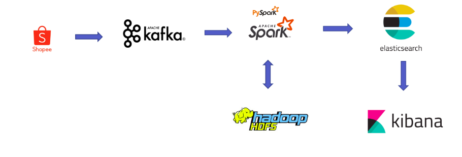

# Shopee Analysis
Visualize some attribute of item and shop in shopee
## System architecture:

## Setup system
### Install Kafka, Zookeeper, Spark, Hadoop in local
- Install Kafka (integrated Zookeeper): https://kafka.apache.org/downloads
- Install Hadoop: https://phoenixnap.com/kb/install-hadoop-ubuntu
- Install Spark: https://computingforgeeks.com/how-to-install-apache-spark-on-ubuntu-debian/
### Setup Kibana, Elasticsearch using docker

```
version: "3"
services:
  elasticsearch:
    container_name: es-container
    image: docker.elastic.co/elasticsearch/elasticsearch:7.11.0
    environment:
      - xpack.security.enabled=false
      - "discovery.type=single-node"
    networks:
      project3-network:
        ipv4_address: 172.25.0.11
    ports:
      - 9200:9200
  kibana:
    container_name: kb-container
    image: docker.elastic.co/kibana/kibana:7.11.0
    environment:
      - ELASTICSEARCH_HOSTS=http://es-container:9200
    networks:
      project3-network:
        ipv4_address: 172.25.0.12
    depends_on:
      - elasticsearch
    ports:
      - 5601:5601
networks:
  project3-network:
    driver: bridge
    ipam:
      driver: default
      config:
        - subnet: 172.25.0.0/16
```
### Next Step: Crawl data from Shopee and publishing to Kafka

### Next Step: Streaming data from Kafka to HDFS

### Next Step: Upload data from HDFS to Elasticsearch

### Final: Visualize data from Elasticsearch using Kibana